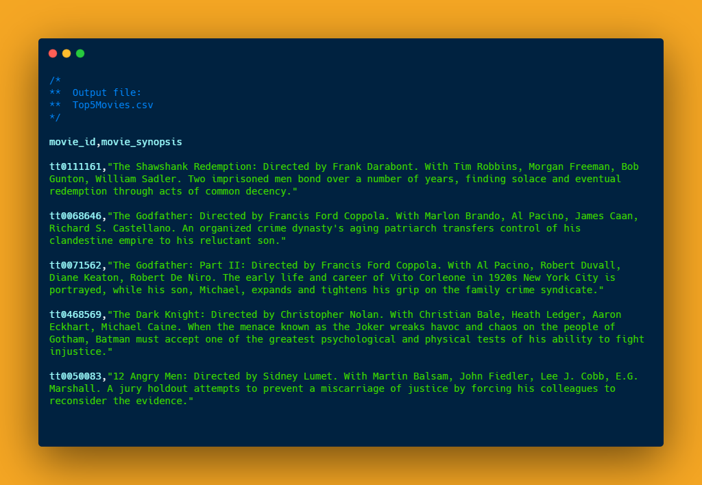
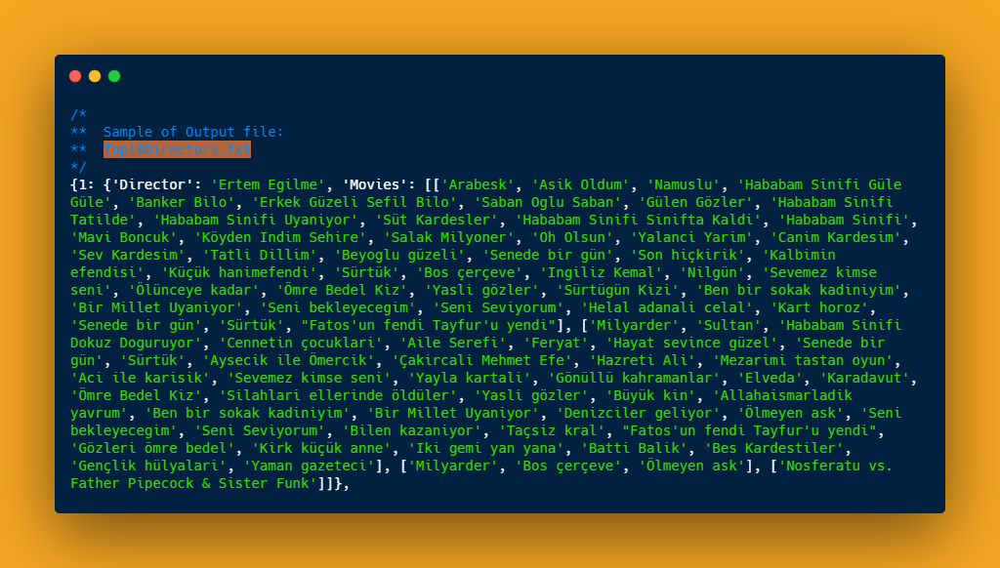

# IMDb-web-scrapper

- IMDb web scrapper is a project which scrapes for:
  - Top 5 Movies and exports the output in the form of csv file
  - Top 10 Directors, their entire list of movies and exports in the form of text file

## What's Unique about this project

- IMDb web scrapper is a python project which collects the data from IMDb website using web scrapping.
- The project also uses pure functions to achieve predictable data manipulation.
- The python code is very clean, readable and modular which follows DRY principle (Donot Repeat Yourself).
- The output is exported in the form of CSV and TXT files.

### Output files

 

### Requirements
- Python packages:
  - beautifulsoup4
  - requests
  - csv
  - lxml
